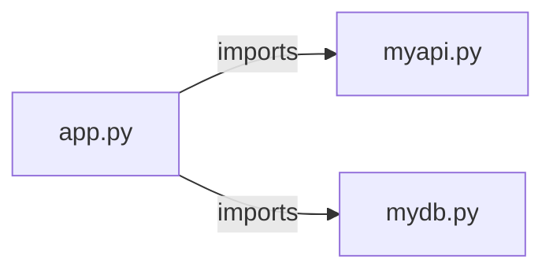

# nlpapp — project architecture

[README](README.md) · [Interview questions and answers](INTERVIEW_QA.md)

## Purpose and scope

A Python desktop NLP application built with Tkinter, object-oriented design, JSON storage, and an external NLP API.

This document describes files and symbols in this checkout. Deployment templates and statements in the original overview are distinguished from a verified running environment.

## Component diagram



For Python repositories, arrows show resolved local imports, not network calls or deployment order. Otherwise the diagram is a repository component map; containment arrows do not assert runtime integration.

## Components and responsibilities

| Component | Responsibility |
| --- | --- |
| [`app.py`](app.py) | Functions: `__init__`, `login_gui`, `register_gui`, `clear`, `perform_registration`, `perform_login`, `home_gui` |
| [`myapi.py`](myapi.py) | Functions: `__init__`, `sentiment_analysis`, `ner`, `emotion_prediction` |
| [`mydb.py`](mydb.py) | Functions: `add_data`, `search` |
| [`README.md`](README.md) | Project explanations or operating notes |

## Implementation walkthrough

### `register_gui(self)`

Source: [`app.py`](app.py#L55).

Calls visible in this function: `Button`, `Entry`, `Label`, `heading.configure`, `heading.pack`, `label0.pack`, `label1.pack`, `label2.pack`, `label3.pack`, `redirect_btn.pack`, `register_btn.pack`, `self.clear`.

```python
    def register_gui(self):
        self.clear()

        heading = Label(self.root, text='NLPApp', bg='#34495E', fg='white')
        heading.pack(pady=(30, 30))
        heading.configure(font=('verdana', 24, 'bold'))

        label0 = Label(self.root, text='Enter Name')
        label0.pack(pady=(10, 10))

        self.name_input = Entry(self.root, width=50)
        self.name_input.pack(pady=(5, 10), ipady=4)

        label1 = Label(self.root, text='Enter Email')
        label1.pack(pady=(10, 10))

        self.email_input = Entry(self.root, width=50)
        self.email_input.pack(pady=(5, 10), ipady=4)

        label2 = Label(self.root, text='Enter Password')
        label2.pack(pady=(10, 10))

```

The excerpt is truncated; the linked source contains the full implementation.

### `login_gui(self)`

Source: [`app.py`](app.py#L26).

Calls visible in this function: `Button`, `Entry`, `Label`, `heading.configure`, `heading.pack`, `label1.pack`, `label2.pack`, `label3.pack`, `login_btn.pack`, `redirect_btn.pack`, `self.clear`, `self.email_input.pack`.

```python
    def login_gui(self):

        self.clear()

        heading = Label(self.root,text='NLPApp',bg='#34495E',fg='white')
        heading.pack(pady=(30,30))
        heading.configure(font=('verdana',24,'bold'))

        label1 = Label(self.root,text='Enter Email')
        label1.pack(pady=(10,10))

        self.email_input = Entry(self.root,width=50)
        self.email_input.pack(pady=(5,10),ipady=4)

        label2 = Label(self.root, text='Enter Password')
        label2.pack(pady=(10, 10))

        self.password_input = Entry(self.root, width=50,show='*')
        self.password_input.pack(pady=(5, 10), ipady=4)

        login_btn = Button(self.root,text='Login',width=30,height=2,command=self.perform_login)
        login_btn.pack(pady=(10,10))
```

The excerpt is truncated; the linked source contains the full implementation.

### `sentiment_gui(self)`

Source: [`app.py`](app.py#L142).

Calls visible in this function: `Button`, `Entry`, `Label`, `goback_btn.pack`, `heading.configure`, `heading.pack`, `heading2.configure`, `heading2.pack`, `label1.pack`, `self.clear`, `self.sentiment_input.pack`, `self.sentiment_result.configure`.

```python
    def sentiment_gui(self):

        self.clear()

        heading = Label(self.root, text='NLPApp', bg='#34495E', fg='white')
        heading.pack(pady=(30, 30))
        heading.configure(font=('verdana', 24, 'bold'))

        heading2 = Label(self.root, text='Sentiment Analysis', bg='#34495E', fg='white')
        heading2.pack(pady=(10, 20))
        heading2.configure(font=('verdana', 20))

        label1 = Label(self.root, text='Enter the text')
        label1.pack(pady=(10, 10))

        self.sentiment_input = Entry(self.root, width=50)
        self.sentiment_input.pack(pady=(5, 10), ipady=4)

        sentiment_btn = Button(self.root, text='Analyze Sentiment', command=self.do_sentiment_analysis)
        sentiment_btn.pack(pady=(10, 10))

        self.sentiment_result = Label(self.root, text='',bg='#34495E',fg='white')
```

The excerpt is truncated; the linked source contains the full implementation.

### `home_gui(self)`

Source: [`app.py`](app.py#L120).

Calls visible in this function: `Button`, `Label`, `emotion_btn.pack`, `heading.configure`, `heading.pack`, `logout_btn.pack`, `ner_btn.pack`, `self.clear`, `sentiment_btn.pack`.

```python
    def home_gui(self):

        self.clear()

        heading = Label(self.root, text='NLPApp', bg='#34495E', fg='white')
        heading.pack(pady=(30, 30))
        heading.configure(font=('verdana', 24, 'bold'))

        sentiment_btn = Button(self.root, text='Sentiment Analysis', width=30, height=4, command=self.sentiment_gui)
        sentiment_btn.pack(pady=(10, 10))

        ner_btn = Button(self.root, text='Named Entity Recognition', width=30, height=4,
                               command=self.perform_registration)
        ner_btn.pack(pady=(10, 10))

        emotion_btn = Button(self.root, text='Emotion Prediction', width=30, height=4,
                               command=self.perform_registration)
        emotion_btn.pack(pady=(10, 10))

        logout_btn = Button(self.root, text='Logout', command=self.login_gui)
        logout_btn.pack(pady=(10, 10))
```

## Data flow and design decisions

### What is the input-to-output contract of `register_gui`

In [`app.py`](app.py#L55), `register_gui(self)` receives the inputs. The function computes these intermediate values:

- `heading = Label(self.root, text='NLPApp', bg='#34495E', fg='white')`
- `label0 = Label(self.root, text='Enter Name')`
- `self.name_input = Entry(self.root, width=50)`
- `label1 = Label(self.root, text='Enter Email')`
- `self.email_input = Entry(self.root, width=50)`
- `label2 = Label(self.root, text='Enter Password')`
- `self.password_input = Entry(self.root, width=50, show='*')`

## Setup and verification

Follow the existing README and the component-specific instructions linked above. No new application start command is asserted for this repository.

No dedicated test files were found in the inspected first-party file inventory. A future implementation should add executable acceptance checks.

## Operating boundaries and design review

Before turning this checkout into a customer deployment, establish the input contract, data ownership, access controls, failure response, evaluation criteria, and rollback owner. Repository fixtures and unit tests demonstrate local behavior; they do not establish throughput, uptime, compliance, or business impact.

A useful architecture review starts with the linked implementation: identify where input enters, where a decision is made, which state can change, and which external dependency can fail. Add a deployment view only for infrastructure that is actually configured and exercised.
